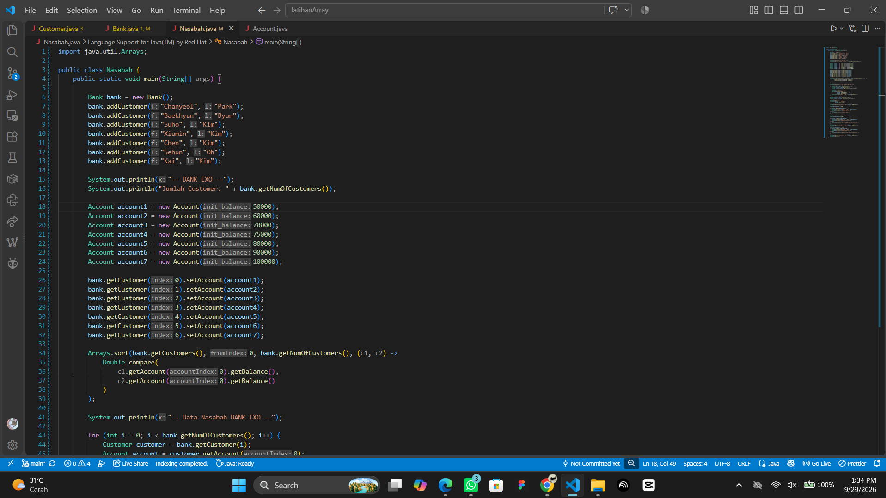

### Library Tambahan

Program menggunakan library `java.util.Arrays` untuk membantu proses pengurutan data customer.

Pada `Nasabah.java`, `Arrays.sort()` digunakan untuk mengurutkan customer berdasarkan saldo rekening, mulai dari saldo terkecil hingga terbesar.

```java
import java.util.Arrays;

